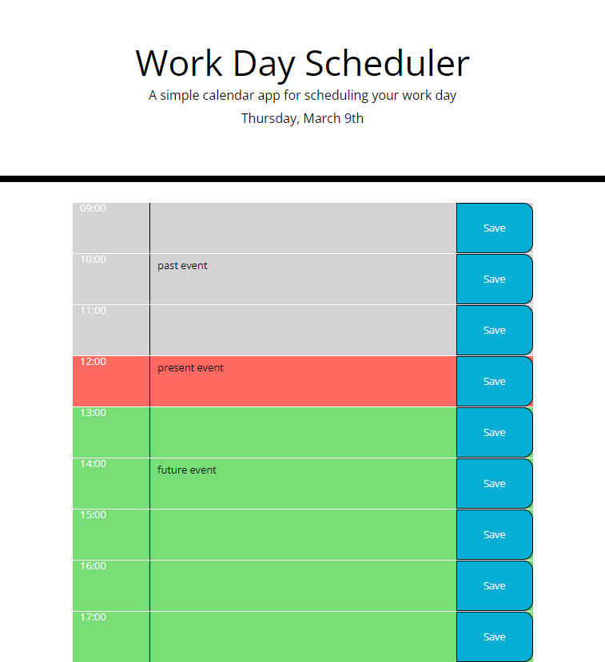

# Daily Planner App

## Table of Content

- [Description](#Description)
- [Visual](#Visual)
- [Built-with:](#Built-with:)
- [What-I-learned](#What-I-learned)
- [Links](#Links)
- [Resources](#Resources)
- [License](#License)

## 1. Description

A calendar app for scheduling daily work plan.+

## 2. Visual

### Color Legend

#### 1. Grey indicates the PAST time, Red indicates the PRESENT time, Green indicates the FUTURE time.

## 3. Built with:

- javascript
- jQuery
- moment.js
- local storage
- Bootstrap
- html
- css

## 4. What I learned

To see how you can add code functions, see below:

## 5. Links

### Source code location

https://github.com/chari00/Daily-Planner-App

### Deployed website URL

https://chari00.github.io/Daily-Planner-App/

## 6. Resources

### URL for resources

- https://momentjs.com/

- https://api.jquery.com/add/

- https://getbootstrap.com/docs/4.0/components/forms/

## 7. License

This project is licensed by MIT.
